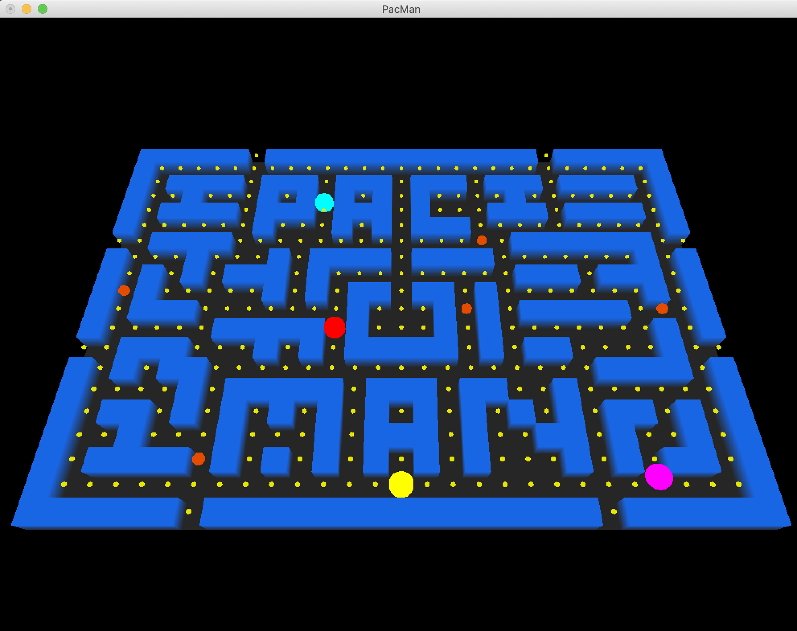

<!-- PROJECT LOGO -->
<br />
<p align="center">
  <a href="https://github.com/sbangad/PacMan">
    
  </a>

  <h3 align="center">Pac Man Game written in OpenGL Library</h3>
</p>

<!-- ABOUT THE PROJECT -->
## About The Project
<p align="center">
    <a href="https://github.com/sbangad/PacMan">
    
</p>
<p align="center">
This Pac Man Game is built using OpenGL and it is a Mini Project for our College Curriculum Course - Computer Graphics and Visualisation.
</p>

### Built With
Our Mini Project is developed on Python and we used the following technologies:
* [OpenGL Library](https://www.opengl.org/)
* [Math Library](https://docs.python.org/3/library/math.html)
* [Time Library](https://docs.python.org/3/library/time.html)


<!-- Our Team -->
## Our Team
This Mini Project was a Group Project assigned to us by our Faculty as a Term Work for our course - Computer Graphics and Visualisation in our SEM 5 of Computer Engineering at K.J. Somaiya College of Engineering.
<br />
We would like to thank [Sir Vaibhav Vasani](https://www.linkedin.com/in/vaibhav-vasani-460a4162/), our Mentor and Faculty-In-Charge for this course who is very motivating and has helped us whenever needed. 
#### Team Members and their Roll Numbers:
* [Sarvesh Bangad](https://www.linkedin.com/in/sarvesh-bangad-450816193/) 1811...
* [Saarah Khan](https://www.linkedin.com/in/saarah-khan-79476717b/) 1811088
* [Anjali Gohil](https://www.linkedin.com/in/anjaligohil19/) 1811080
* [Jugal Chauhan](https://www.linkedin.com/in/jugal-chauhan-8422b9157/) 1811071


<!-- GETTING STARTED -->
## Getting Started

Viewers can simply run this application locally on their devices
To get a local copy of this game up and running follow these simple example steps.

### Prerequisites

This is a list things you need to use the software and how to install them on your devices:

* Memory Space of 50mb in the device
* A functional Laptop/Desktop which supports Python 3.0+ versions

### Installation

#### To install on simulator using Android Studio:
1. Clone the repo
```sh
git clone https://github.com/sbangad/PacMan.git
```
2. We insist on opening this project on VS Code 
3. Install required flutter packages on AndroidStudio
```sh
pip install -r requirements.txt
```
4. Run the main.py File


<!-- CONTRIBUTING -->
## Contributing

Contributions are what make the open source community such an amazing place to be learn, inspire, and create. Any contributions you make are **greatly appreciated**.

1. Fork the Project
2. Create your Feature Branch (`git checkout -b feature/AmazingFeature`)
3. Commit your Changes (`git commit -m 'Add some AmazingFeature'`)
4. Push to the Branch (`git push origin feature/AmazingFeature`)

<br />

[Back to Top](https://github.com/sbangad/PacMan#About-The-Project)
